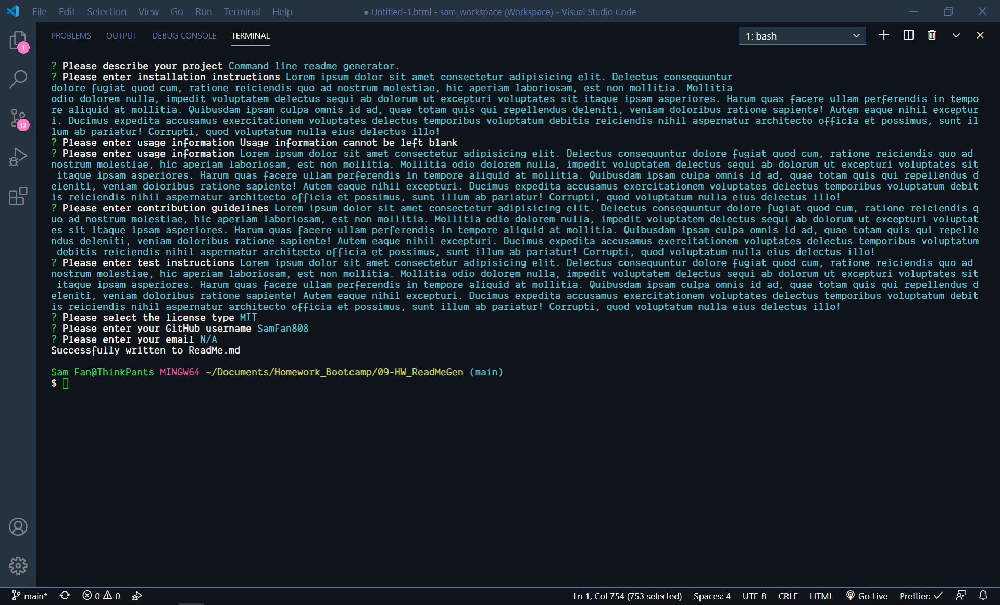

# ReadMe_machine

# Project Name: ReadMe_machine

## Description

Command line application written in JavaScript utilizing Node.js and npm Inquirer to use user input to generate a readme markdown file.

## Table of Contents

1. [Installation](#installation)

2. [Usage](#usage)

3. [License](#license)

4. [Contributing](#contributing)

5. [Testing](#testing)

6. [Questions](#questions)

## Installation

Requires Node.js installation. In Terminal, run command <node index.js> and follow prompts to enter pertinent information.

## Usage

For general use.

link to video: https://youtu.be/lrXw60owqPE

Screenshot below:

## License

Licensed under: N/A

## Contributing

Not accepting contributions at this time.

## Testing

N/A

## Questions

GitHub Repository:

http://github.com/SamFan808

For any questions, please contact me at N/A
